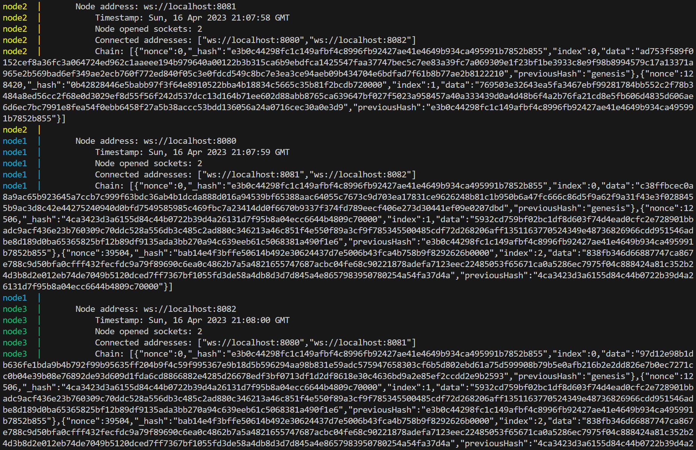

# Wheelchair blockhain
Student blockchain project within the educational SPBSTU project

### [Original task](https://github.com/SemenMartynov/Software-Engineering-2022/blob/main/NetworkProgrammingTask.md)

## Run blockchain (Docker)

1. The ports of the three nodes specified in `docker-compose.yml` must be open (By default its: 8080, 8081, 8082)
2. Install docker
3. Run `docker compose up` from project directory

## Example of usage

Each node writes a state log once in a while, so you can track the state of the chain and its synchronization in other nodes.

